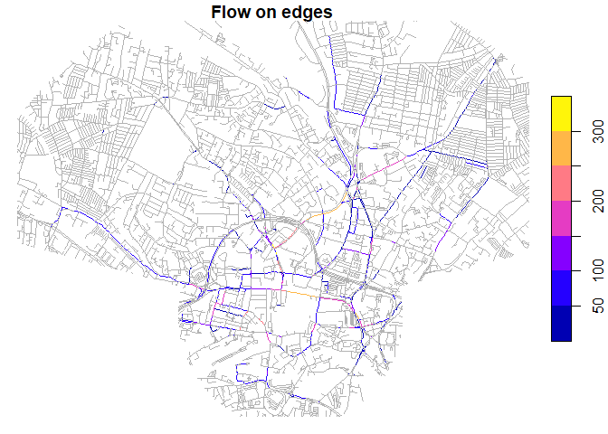

<!-- README.md is generated from README.Rmd. Please edit that file -->

# sfrouting 🏗️ work in progress 🏗️

<!-- badges: start -->

[](https://github.com/Robinlovelace/sfrouting/actions/workflows/R-CMD-check.yaml)
<!-- badges: end -->

The goal of sfrouting is to enable people to generate routes for
reproducible research. The package provides an interface between
{[sfnetworks](https://luukvdmeer.github.io/sfnetworks/)} and
{[cppRouting](https://cran.r-project.org/package=cppRouting)} R
packages.

Design principles are for the package to work with `sf` and `sfnetworks`
objects and to output `sf` objects.

## Installation

You can install the development version of sfrouting from
[GitHub](https://github.com/) with:

``` r
# install.packages("pak")
pak::pak("Robinlovelace/sfrouting")
```

## Example

Let’s do some routing within a city of your choice. Change the name of
the city and `max_circle_id` and `segment_ids` objects in the code chunk
below to test the package for yourself elsewhere.

``` r
# library(sfrouting)
devtools::load_all()
#> ℹ Loading sfrouting
library(sf)
#> Linking to GEOS 3.12.1, GDAL 3.8.4, PROJ 9.3.1; sf_use_s2() is TRUE
library(tidyverse)
#> ── Attaching core tidyverse packages ──────────────────────── tidyverse 2.0.0 ──
#> ✔ dplyr     1.1.4     ✔ readr     2.1.5
#> ✔ forcats   1.0.0     ✔ stringr   1.5.1
#> ✔ ggplot2   3.5.2     ✔ tibble    3.3.0
#> ✔ lubridate 1.9.4     ✔ tidyr     1.3.1
#> ✔ purrr     1.1.0     
#> ── Conflicts ────────────────────────────────────────── tidyverse_conflicts() ──
#> ✖ dplyr::filter() masks stats::filter()
#> ✖ dplyr::lag()    masks stats::lag()
#> ℹ Use the conflicted package (<http://conflicted.r-lib.org/>) to force all conflicts to become errors
library(sfnetworks)
# Get study area boundar
zones_area = zonebuilder::zb_zone("Leeds", n_circles = 7)
#> Loading required namespace: tmaptools
# mapview::mapview(zones_area, zcol = "circle_id")
# zonebuilder::zb_plot(zones_area)
max_circle_id = 2 # max diameter of study area
segment_ids = c(0:2, 10:12) # 0:12 for all segments
zones = zones_area |> 
  dplyr::select(-centroid) |> 
  dplyr::filter(circle_id <= max_circle_id & segment_id %in% segment_ids)
# plot(zones)
# mapview::mapview(zones)
area = sf::st_union(zones)
# plot(area)
osm_data = osmactive::get_travel_network(
  # place = "west yorkshire", # For specific download
  place = area,
  boundary = area,
  boundary_type = "clipsrc"
)
#> The input place was matched with West Yorkshire. 
#> The chosen file was already detected in the download directory. Skip downloading.
#> Starting with the vectortranslate operations on the input file!
#> Warning in CPL_gdalvectortranslate(source, destination, options, oo, doo, :
#> GDAL Message 1: A geometry of type MULTILINESTRING is inserted into layer lines
#> of geometry type LINESTRING, which is not normally allowed by the GeoPackage
#> specification, but the driver will however do it. To create a conformant
#> GeoPackage, if using ogr2ogr, the -nlt option can be used to override the layer
#> geometry type. This warning will no longer be emitted for this combination of
#> layer and feature geometry type.
#> Finished the vectortranslate operations on the input file!
#> Matched these columns: lanes_psvlanes_buslanes_bus_conditionallanes_bus_backwardlanes_bus_forwardlanes_psv_backwardlanes_psv_forwardlanes_psv_conditionallanes_psv_conditional_backwardlanes_psv_conditional_forwardlanes_psv_conditional_both_wayslanes_psv_both_ways
osm_drive = osmactive::get_driving_network(osm_data)
osm_drive = sf::st_cast(osm_drive, "LINESTRING")
#> Warning in st_cast.sf(osm_drive, "LINESTRING"): repeating attributes for all
#> sub-geometries for which they may not be constant
```

Let’s take a look at the OSM data we have downloaded:

``` r
plot(osm_drive["highway"])
```


``` r
nrow(osm_drive)
#> [1] 4975
# mapview::mapview(osm_drive, zcol = "highway", lwd = 1)
```

``` r
sfn = as_sfnetwork(osm_drive, directed = FALSE)
# Add node IDs to sfn for routing, needed for filter() below
sfn = sfn |>
  activate("nodes") |>
  mutate(ID = row_number())
nodes = sfn |> 
  st_as_sf()
sfn_edges = sfn |> 
  activate("edges") |>
  st_as_sf()
graph = sfn_to_cpprouting(sfn)
nrow(graph$coords)
#> [1] 7055
```

Let’s calculate a route from Scott Hall Road to University Road:

``` r
origin_road = sfn |> 
  activate("edges") |>
  filter(name == "Scott Hall Road") |>
  activate("nodes") |>
  filter(!tidygraph::node_is_isolated()) |>
  st_as_sf()
# plot(origin_road)
node_id = origin_road$ID[1]

destination_road = sfn |> 
  activate("edges") |>
  filter(name == "University Road") |>
  activate("nodes") |>
  filter(!tidygraph::node_is_isolated()) |>
  st_as_sf()
# plot(destination_road)
destination_node_id = destination_road$ID[1]

route_sf = sr_route(sfn, from = node_id, to = destination_node_id)
plot(route_sf["maxspeed"])
```


``` r
# mapview::mapview(route_sf, zcol = "maxspeed", lwd = 1)
```

``` r
# Let's calculate for n random routes
set.seed(123)
n_routes = 1000
random_routes = tibble(
  from = sample(nodes$ID, n_routes, replace = TRUE),
  to = sample(nodes$ID, n_routes, replace = TRUE)
) |>
  filter(from != to)
nrow(random_routes)
#> [1] 1000
routes = cppRouting::get_path_pair(
  Graph = graph,
  from = random_routes$from,
  to = random_routes$to
)
length(routes)
#> [1] 1000
# Convert to sfnetwork
routes_osm_ids = purrr::map_dfr(routes, function(route) {
  routes_sfn = sfn |>
    activate("nodes") |>
    filter(ID %in% route) |>
    activate("edges") |>
    st_as_sf() |>
    sf::st_drop_geometry() |>
    select(osm_id)
})
osm_ids_grouped = routes_osm_ids |>
  group_by(osm_id) |>
  summarise(n = n())
osm_drive_n = dplyr::inner_join(
  osm_drive |>
    select(osm_id),
  osm_ids_grouped
)
#> Joining with `by = join_by(osm_id)`
# plot(osm_drive_n["n"], main = "Number of routes per OSM ID")
# mapview::mapview(osm_drive_n, zcol = "n", lwd = 1)
```

``` r
# Let's calculate traffic starting with from, to, demand matrix
n_trips = 10000
trips = data.frame(
  from = sample(nodes$ID, n_trips, replace = TRUE),
  to = sample(nodes$ID, n_trips, replace = TRUE),
  demand = runif(1, 10, n_trips) # Random demand between 1 and 10
)
aon = cppRouting::get_aon(
  Graph = graph,
  from = trips$from,
  to = trips$to,
  demand = trips$demand
)
head(aon)
#>   from   to      cost     flow
#> 1    1    2 123.73172 16544.58
#> 2    1  503 139.52294 89340.71
#> 3    1 1864  88.44373 46324.81
#> 4    3    4  69.67965     0.00
#> 5    5    6 119.14023     0.00
#> 6    7    8 126.62139     0.00
sfn_aon = left_join(
  sfn_edges |>
    mutate(across(from:to, as.character)),
  aon
)
#> Joining with `by = join_by(from, to)`
#> Warning in sf_column %in% names(g): Detected an unexpected many-to-many relationship between `x` and `y`.
#> ℹ Row 19 of `x` matches multiple rows in `y`.
#> ℹ Row 1989 of `y` matches multiple rows in `x`.
#> ℹ If a many-to-many relationship is expected, set `relationship =
#>   "many-to-many"` to silence this warning.
plot(sfn_aon["flow"], main = "Flow on edges", logz = TRUE)
#> Warning in classInt::classIntervals(v0, min(nbreaks, n.unq), breaks, warnSmallN
#> = FALSE): var has infinite values, omitted in finding classes
```



``` r
# mapview::mapview(sfn_aon, zcol = "flow", lwd = 1)
```
